  

  <strong>I turn agent failures into traces, invariants, and regression tests.</strong> 
  AI systems engineering across protocols, evals, memory, and workflow reliability.

  Bengaluru · open to India, remote, and relocation 
  <a href="mailto:raghavaryen@gmail.com">Email</a> ·
  <a href="https://linkedin.com/in/raghav-sharma-74577931a">LinkedIn</a>

## Evidence, not adjectives

**01 / External selection.** Won the **AMD Developer Hackathon 2026**
fine-tuning track with
[BrainConnect-ASD](https://github.com/Yatsuiii/Brain-Connectivity-GCN), a
site-adversarial GNN evaluated leave-one-site-out: 529 held-out subjects across
four sites, ROC AUC 0.7872.

**02 / Upstream fixes.** Reproduced a live Vertex AI Memory Bank metadata-loss
bug and shipped the typed conversion
[into Google ADK main](https://github.com/google/adk-python/commit/3a37d7ac2abc7a9e73e922b87ef7116f654b3957).
For DataHub, replaced destructive incident updates with field-level patch
semantics in [PR #18826](https://github.com/datahub-project/datahub/pull/18826):
17 files, +1,621/-380, with 15 inline review comments. Followed it
with [idempotent incident creation](https://github.com/datahub-project/datahub/pull/18900).

**03 / Protocol correctness.** Seven merged contributions across AgenTrust's
cMCP and conformance suite, including a
[session-independent execution-correlation specification](https://github.com/agentrust-io/cmcp/pull/574),
[nested argument validation](https://github.com/agentrust-io/trace-tests/pull/85),
and [protocol-correct JSON-RPC handling](https://github.com/agentrust-io/cmcp/pull/561).

## Systems I own

### [Custody](https://github.com/Yatsuiii/custody)

**Which memories must disappear when a source becomes untrusted?** A provenance
and derivation graph for agent memory with selective descendant revocation,
signed tool bindings, nonce-based replay resistance, drift detection, and
failure injection. 409 passing tests in the current verification suite.

### [ACE · API Causality Engine](https://github.com/Yatsuiii/api-causality-engine)

**Why did the same API workflow take a different path in two environments?** A
five-crate Rust engine that records typed execution graphs and diffs the
transition, routing, retry, join, and failure-policy decisions that caused the
divergence. 249 passing tests.

### [LLMTrace](https://github.com/Yatsuiii/llmtrace)

**Which deployment caused an LLM cost or latency regression?** A single Go
binary that joins model telemetry to deployment SHAs, fetches implicated diffs,
and applies deterministic scoring before model-generated explanation.

## Research without result laundering

My [ARC-AGI-2 experiments](https://github.com/Yatsuiii/arc-agi-2-2026-research)
were preregistered and task-group cross-validated. All six learned-verifier
variants lost to the frozen baseline, so I stopped the direction instead of
post-hoc retuning it.

## What I am looking for

**AI systems engineering at an early-stage AI company**, especially agent
reliability, evals, protocol correctness, MCP/tooling, and failure-aware
workflow infrastructure.
