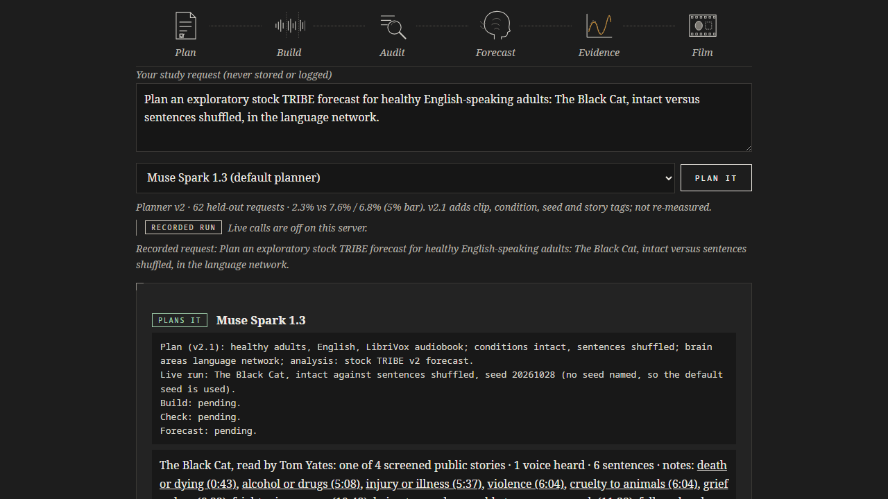
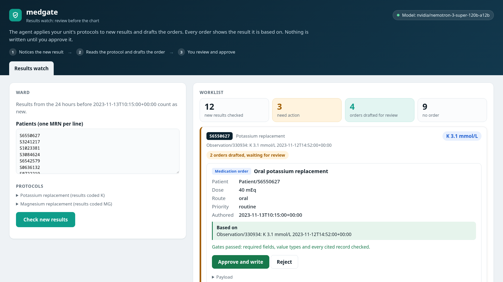
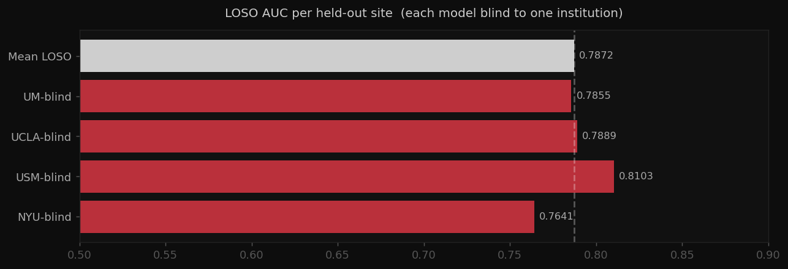

I'm building [StillHere](https://github.com/Yatsuiii/stillhere), my flagship tool for brain-imaging researchers planning studies where people listen to stories.

> **Pre-registered result · 22 listeners**
>
> TRIBE v2's language readout was stronger for an intact story than for its sentence-shuffled version: **p = 0.00516**.
>
> [Result](https://github.com/Yatsuiii/stillhere/blob/main/results/d20_notthefall.json) · [Protocol](https://github.com/Yatsuiii/stillhere/blob/main/PREREG.md) · [Scoring hash registry](https://github.com/Yatsuiii/stillhere/blob/main/prereg_registry.json)

The [failed secondary test](https://github.com/Yatsuiii/stillhere/blob/main/results/d20_notthefall.json) and [order-map no-go](https://github.com/Yatsuiii/stillhere/blob/main/results/order_map_gonogo.json) remain published alongside the positive result.

I also build [Fractured Perception](https://github.com/Yatsuiii/fractured_perception/tree/claude/gameplay-itt), a cooperative Unity game.

## Start here

<table>
  <tr>
    <td width="50%" valign="top">
      <h3><a href="https://github.com/Yatsuiii/stillhere">StillHere</a></h3>
      
Plans story-listening studies for brain-imaging labs.

      
      
Recorded planner demo.

      <a href="https://github.com/Yatsuiii/stillhere/blob/main/results/d20_notthefall.json">Result</a> · <a href="https://github.com/Yatsuiii/stillhere/blob/main/PREREG.md">Protocol</a>
    </td>
    <td width="50%" valign="top">
      <h3><a href="https://github.com/Yatsuiii/medgate">Medgate</a></h3>
      
Turns lab results into draft orders a clinician reviews. Synthetic data only.

      
      
Order-review screen from the repository.

      <a href="https://github.com/Yatsuiii/medgate#results">Results</a> · <a href="https://github.com/Yatsuiii/medgate#what-the-gates-catch">Gate limits</a>
    </td>
  </tr>
  <tr>
    <td width="50%" valign="top">
      <h3><a href="https://github.com/Yatsuiii/Brain-Connectivity-GCN">BrainConnect-ASD</a></h3>
      
Studies autism classification from fMRI across scanning sites. Research use.

      
      
Repository figure: each site was excluded from training for its test. Longer bars mean better separation between groups.

      <a href="https://github.com/Yatsuiii/Brain-Connectivity-GCN">Code</a> · <a href="https://github.com/Yatsuiii/Brain-Connectivity-GCN/blob/main/MODEL_CARD.md">Model card</a>
    </td>
    <td width="50%" valign="top">
      <h3><a href="https://github.com/Yatsuiii/fractured_perception/tree/claude/gameplay-itt">Fractured Perception</a></h3>
      
A cooperative Unity game where players see different information.

      
<strong>Private repository.</strong>

      <a href="https://github.com/Yatsuiii/fractured_perception/tree/claude/gameplay-itt">Current branch</a> · <a href="https://github.com/Yatsuiii/fractured_perception/blob/claude/gameplay-itt/docs/STAGE1_DESIGN.md">Design</a>
    </td>
  </tr>
</table>
